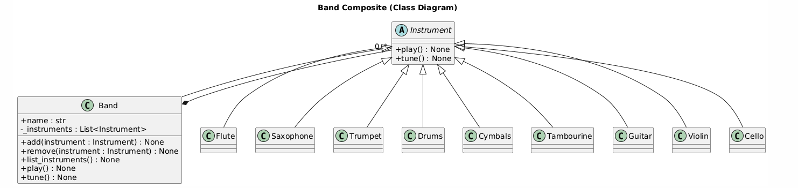

Create a Composite pattern application in Python based on the following scenario: There is a band with different types of instruments: wind, percussion, and strings. For each type, there are three instruments. The band is responsible for playing and tuning the instruments, which can be added and removed without restriction. In the end, everything must be output to the terminal.

from abc import ABC, abstractmethod
from typing import List

# Component: Abstract base class for all instruments
class Instrument(ABC):
    """Abstract component that defines the interface for all instruments"""
    
    @abstractmethod
    def play(self) -> None:
        """Play the instrument"""
        pass
    
    @abstractmethod
    def tune(self) -> None:
        """Tune the instrument"""
        pass

# Leaf: Wind Instruments
class Flute(Instrument):
    def play(self) -> None:
        print("  🎵 Flute: Playing a melodious tune")
    
    def tune(self) -> None:
        print("  🔧 Flute: Adjusting embouchure hole")

class Saxophone(Instrument):
    def play(self) -> None:
        print("  🎷 Saxophone: Playing smooth jazz notes")
    
    def tune(self) -> None:
        print("  🔧 Saxophone: Adjusting reed and mouthpiece")

class Trumpet(Instrument):
    def play(self) -> None:
        print("  🎺 Trumpet: Playing bright brass sounds")
    
    def tune(self) -> None:
        print("  🔧 Trumpet: Adjusting valve slides")

# Leaf: Percussion Instruments
class Drums(Instrument):
    def play(self) -> None:
        print("  🥁 Drums: Playing rhythmic beats")
    
    def tune(self) -> None:
        print("  🔧 Drums: Tightening drum heads")

class Cymbals(Instrument):
    def play(self) -> None:
        print("  🥁 Cymbals: Crashing with energy")
    
    def tune(self) -> None:
        print("  🔧 Cymbals: Cleaning and positioning")

class Tambourine(Instrument):
    def play(self) -> None:
        print("  🪘 Tambourine: Shaking with rhythm")
    
    def tune(self) -> None:
        print("  🔧 Tambourine: Adjusting jingles tension")

# Leaf: String Instruments
class Guitar(Instrument):
    def play(self) -> None:
        print("  🎸 Guitar: Strumming chords")
    
    def tune(self) -> None:
        print("  🔧 Guitar: Tuning strings to E-A-D-G-B-E")

class Violin(Instrument):
    def play(self) -> None:
        print("  🎻 Violin: Playing elegant melodies")
    
    def tune(self) -> None:
        print("  🔧 Violin: Adjusting pegs to G-D-A-E")

class Cello(Instrument):
    def play(self) -> None:
        print("  🎻 Cello: Playing deep resonant tones")
    
    def tune(self) -> None:
        print("  🔧 Cello: Tuning strings to C-G-D-A")

# Composite: Band that can contain multiple instruments
class Band(Instrument):
    """Composite class that can contain and manage multiple instruments"""
    
    def __init__(self, name: str = "Band"):
        self.name = name
        self._instruments: List[Instrument] = []
    
    def add(self, instrument: Instrument) -> None:
        """Add an instrument to the band"""
        self._instruments.append(instrument)
        instrument_name = instrument.__class__.__name__
        print(f"✓ {instrument_name} added to {self.name}")
    
    def remove(self, instrument: Instrument) -> None:
        """Remove an instrument from the band"""
        if instrument in self._instruments:
            self._instruments.remove(instrument)
            instrument_name = instrument.__class__.__name__
            print(f"✗ {instrument_name} removed from {self.name}")
        else:
            print(f"⚠ Instrument not found in {self.name}")
    
    def play(self) -> None:
        """Play all instruments in the band"""
        print(f"\n{'='*50}")
        print(f"🎼 {self.name} is performing!")
        print(f"{'='*50}")
        if not self._instruments:
            print("  (No instruments in the band)")
        else:
            for instrument in self._instruments:
                instrument.play()
        print(f"{'='*50}\n")
    
    def tune(self) -> None:
        """Tune all instruments in the band"""
        print(f"\n{'='*50}")
        print(f"🔧 {self.name} is tuning all instruments")
        print(f"{'='*50}")
        if not self._instruments:
            print("  (No instruments to tune)")
        else:
            for instrument in self._instruments:
                instrument.tune()
        print(f"{'='*50}\n")
    
    def list_instruments(self) -> None:
        """List all instruments in the band"""
        print(f"\n📋 Instruments in {self.name}:")
        if not self._instruments:
            print("  (No instruments)")
        else:
            for i, instrument in enumerate(self._instruments, 1):
                print(f"  {i}. {instrument.__class__.__name__}")
        print()

# Main demonstration
def main():
    print("\n" + "="*50)
    print("🎵 COMPOSITE PATTERN: BAND MANAGEMENT SYSTEM 🎵")
    print("="*50 + "\n")
    
    # Create the band (Composite)
    orchestra = Band("Symphony Orchestra")
    
    print("--- ADDING WIND INSTRUMENTS ---")
    flute = Flute()
    saxophone = Saxophone()
    trumpet = Trumpet()
    orchestra.add(flute)
    orchestra.add(saxophone)
    orchestra.add(trumpet)
    
    print("\n--- ADDING PERCUSSION INSTRUMENTS ---")
    drums = Drums()
    cymbals = Cymbals()
    tambourine = Tambourine()
    orchestra.add(drums)
    orchestra.add(cymbals)
    orchestra.add(tambourine)
    
    print("\n--- ADDING STRING INSTRUMENTS ---")
    guitar = Guitar()
    violin = Violin()
    cello = Cello()
    orchestra.add(guitar)
    orchestra.add(violin)
    orchestra.add(cello)
    
    # List all instruments
    orchestra.list_instruments()
    
    # Tune all instruments
    orchestra.tune()
    
    # Play all instruments
    orchestra.play()
    
    # Remove some instruments
    print("--- REMOVING INSTRUMENTS ---")
    orchestra.remove(saxophone)
    orchestra.remove(tambourine)
    
    # List updated instruments
    orchestra.list_instruments()
    
    # Play with remaining instruments
    orchestra.play()
    
    # Demonstrate empty band
    print("--- TESTING EMPTY BAND ---")
    jazz_band = Band("Jazz Ensemble")
    jazz_band.list_instruments()
    jazz_band.tune()
    jazz_band.play()

if __name__ == "__main__":
    main()
